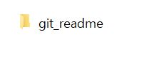

# Git 사용법

- 참고 영상
  - https://www.youtube.com/watch?v=FXDjmsiv8fI&t=632s

---

## Git 저장소 생성 및 예제 파일 생성
- Git 저장소 생성
  - 컴퓨터에서 원하는 위치에 프로젝트를 진행할 폴더 생성
    - 
  - git init (저장소 만들기)
    - 
  - git config --global user.name "(내 이름)"
    - 내 이름 == 자신의 git hub 이름
    - 
  - git config --global user.email "(내 메일주소)"
    - 내 주소 == 자신의 git hub 이메일 주소
    - 
  - 위 작업 수행 후 숨겨진 파일인 .git 폴더 생성이 됨
    - 
    - .git 폴더는 git 관리 느낌으로 git 저장소 의미

- 예제 파일 생성
  - 저장소 폴더에서 git bash를 실행 한 뒤 리눅스에서 파일 만드는것 처럼 vi (파일이름) 후 내용 적기
  - ex1>cat
    - 
    - 
      - 내용 적기 -> esc -> :wq
  - ex2>mouse
    - cat과 똑같이 내용에 name : jerry 적고 저장
  - 
  
---

## 현재 시점 저장하기(add & commit)
- 현재 시점 저장하기 == 타임캡슐에 내용물을 담고 이 내용물이 무엇인지 뜻하는 tag를 달아서 땅바닥에 묻는 작업
- git status
  - 현재 담을게 무엇이 있는지 git 입장에서 살펴보기
  - 
  - 

---

## 이후 새 파일 만들기 & commit 하기
- 예제 파일 만들기
  - dog 파일 만들고 name : snoopy 로 저장
- git status
  - 현재 담을 수 있는것은 dog가 있다는 것을 확인가능.
- git add dog
  - dog 파일을 타임캡슐에 담기
- git commit -m "Add Dog"
  - git status를 입력하면 changes~~ 부분에 타임캡슐에 담긴 내용 확인(dog)
  - git commit -m "Add Dog"
    - 새 캡슐이 묻힌거임

---

## git log (이때까지의 commit 확인)
- git log를 통해 이때까지의 commit 확인해보기

---

## 조금 더 다양한 변화를 주고 commit 해보기
- cat file 삭제
  - rm cat하면 됨
- mouse의 내용물을 name : mickey로 변경
- penguin 파일을 만든 후 name : pororo 작성
- 그 후 git status 확인
  - Untracked files의 penguin == penguin을 담을 수 있다.
  - Changes not staegd for commit에서의 파일들
    - modified -> 수정된 파일
    - deleted -> 삭제된 파일
- 이러한 변화들을 git add -A로 타임캡슐에 담기
- git commit -m "Add Modify Delete"
  -담았으니까 commit하기
- git log로 이때까지의 commit 확인
    - 이때까지 commit한 (First Commit, Add Dog, Add Modify Delte)의 모습을 볼 수 있다.

---

## 현재까지 진행상황
- 

---

## 과거로 돌아가기 - Reset (유튜브 보고 참고하기(06:57~))
- 이전에 묻었던 캡슐(commit)을 파내서 과거의 상태로 돌아가기
- 과감한 방법과 신중한 방법이 있다.
  - 과감한 방법(reset) : 돌아갈 과거 이후 행적은 복원할 여지 없이 삭제
    - 돌아갈 시점을 입력
  - 신중한 방법(revert) : 과거로 돌아가 되 돌아갈 여지를 남김
    - 취소할 시점을 입력
    - git revert (commit 앞의 6자리)
